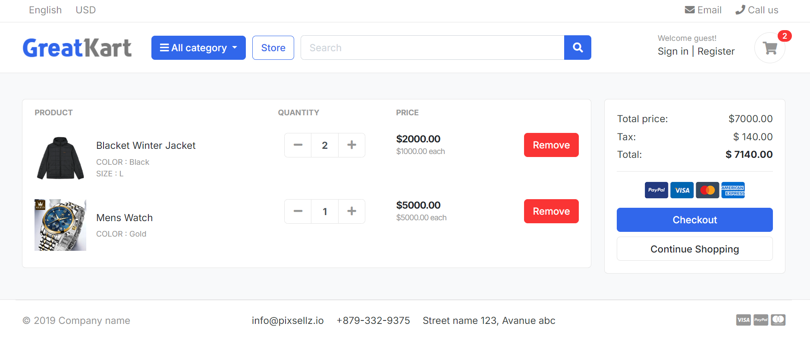
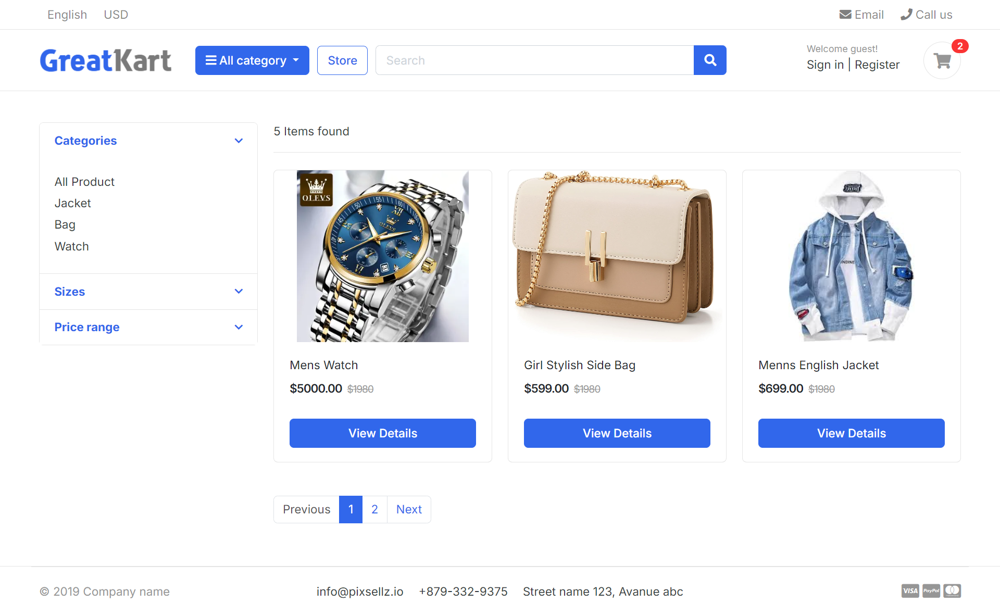

<h1>Django Advanced E-Commerce Website</h1>

<h2>Features</h2>
<ul>
 <li>Product List</li>
 <li>Product Search</li>
 <li>Product Variant</li>
 <li>add to cart</li>

</ul>

 

Cart Image:

 

 Store Image:

